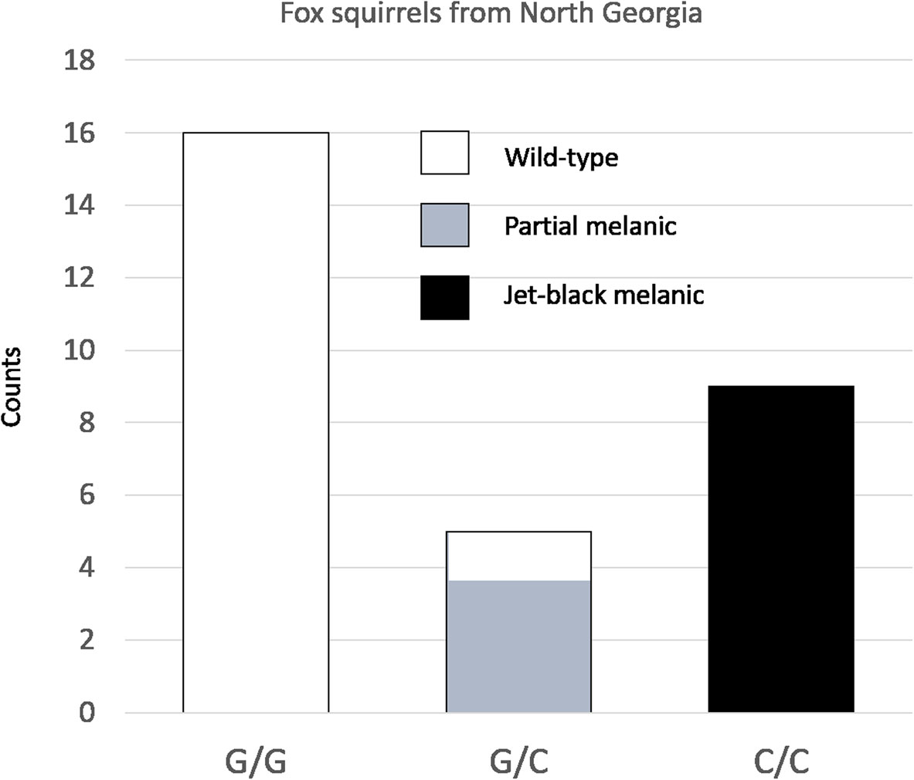

```{r weird, echo=FALSE, fig.align="center", out.width = '50%'}
knitr::include_graphics("images/weird_squirrels.png")
```
(Lehtinen et al. 2019, photos from iNaturalist and J. Furey)

Squirrels on college campuses often have weird coat patterns. Why? The short answer is their small population sizes lead to rare variants becoming common, and certain rare variants cause weird colors. For example, a deletion in a 24bp chunk of the melanocortin 1 receptor is associated with black squirrel morphs of BOTH the eastern fox and eastern gray squirrel species, suggesting there was introgression between them (McRobie et al. 2019).

This 24bp deletion is an example of a "rare variant" that appears to have become relatively common in certain squirrel populations, likely due to random chance aka drift (Lehtinen et a. 2019). When these rare variants becomes frequent enough that homozygous individuals start to arise, we begin to see the distinct coat color phenotypes. Here's an example of a second rare variant (this time a single bp missense mutation) that also causes black coat color:

```{r recessive, echo=FALSE, fig.align="center", out.width = '50%'}

```
(McRobie et al. BMC Evolutionary Biology, 2019)

We can describe how we might end up with weird squirrels by modeling the evolutionary processes that got us here. We will use the Wright-Fisher model to describe how alleles change frequency in populations over generations (next page).
